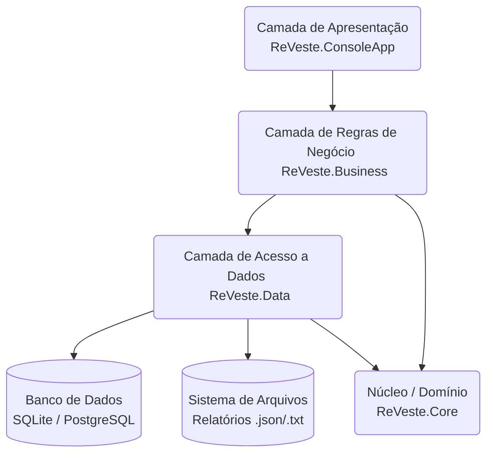

# Projeto ReVeste - Transformando Apostas em Investimentos

  
  
  

> Uma ferramenta transformadora que capacita, apoia e motiva usuários a redirecionarem suas "apostas" para um futuro financeiro mais seguro e próspero.

---

## 📖 Tabela de Conteúdos

1. [🎯 Visão Geral do Projeto](#-visão-geral-do-projeto)  
2. [📸 Demonstração Visual](#-demonstração-visual)  
3. [✨ Funcionalidades Principais](#-funcionalidades-principais)  
4. [🏗️ Arquitetura e Fluxo de Execução](#️-arquitetura-e-fluxo-de-execução)  
5. [🛠️ Tecnologias Utilizadas](#️-tecnologias-utilizadas)  
6. [▶️ Como Executar o Projeto](#️-como-executar-o-projeto)  
7. [✍️ Autores](#️-autores)  

---

## 🎯 Visão Geral do Projeto

O **ReVeste** é uma plataforma inovadora que atua na interseção entre saúde financeira, prevenção ao vício em apostas e educação financeira prática. Diante do crescimento exponencial de plataformas de apostas online no Brasil, o projeto surge como uma solução para um problema social e financeiro significativo. O objetivo principal é capacitar indivíduos a transformar hábitos de apostas em oportunidades de investimento, promovendo a saúde financeira e prevenindo o vício.

Esta implementação representa o **MVP (Minimum Viable Product)** do núcleo do sistema, desenvolvido como uma aplicação de console em C#. A solução simula as funcionalidades centrais da plataforma ReVeste, como o registro de lançamentos, o cálculo do Score de Inteligência Financeira e a geração de relatórios.

---

## 📸 Demonstração Visual

Abaixo, uma simulação da tela principal do Dashboard no console:

--- Seu Dashboard ReVeste --- <br>
Total gasto em apostas: R$ 500,00 <br>
Total investido: R$ 800,00 <br>
Custo de Oportunidade: Seu dinheiro em apostas poderia ter rendido aproximadamente R$ 4,00 este mês.

Score de Inteligência Financeira: 78 <br>
Status: Excelente! Você está no caminho certo para a independência financeira.

---

## ✨ Funcionalidades Principais

- **Registro de Lançamentos:** Permite ao usuário registrar seus gastos com apostas e seus aportes em investimentos.  
- **Dashboard de Conscientização:** Exibe um painel com o total gasto em apostas versus o total investido, mostrando também o custo de oportunidade.  
- **Score de Inteligência Financeira:** Sistema de pontuação baseado na proporção entre investimentos e apostas, gamificando a jornada financeira.  
- **Simulação de Custo de Oportunidade:** Estimativa de quanto o dinheiro gasto em apostas poderia ter rendido.  
- **Exportação de Relatórios:** Geração de relatórios nos formatos `.json` e `.txt`.  

---

## 🏗️ Arquitetura e Fluxo de Execução

### 🔹 Diagrama de Camadas

O projeto segue uma arquitetura em **4 camadas**, inspirada em princípios como **TOGAF** e **ArchiMate**, promovendo baixo acoplamento e escalabilidade.



### 🔹 Fluxo de Execução (Exemplo: Registrar uma Aposta)
ReVeste.ConsoleApp: Recebe a entrada do usuário (descrição e valor da aposta).

ReVeste.Business: O `FinanceiroService` valida os dados e cria um objeto `Lancamento`.

ReVeste.Data: O `LancamentoRepository` utiliza o `ReVesteDbContext` do Entity Framework Core.

EF Core: Traduz o objeto em um comando SQL `INSERT` e o executa no banco `reveste.db`.

---

## 🛠️ Tecnologias Utilizadas
Linguagem: C# 12

Plataforma: .NET 8

ORM: Entity Framework Core 8

Banco de Dados: SQLite (menção a PostgreSQL no design original)

IDE: Visual Studio Code

---

## ▶️ Como Executar o Projeto
### 🔹 Pré-requisitos
.NET 8 SDK

Visual Studio Code

Extensão C# Dev Kit para VS Code

### 🔹 Passos para Instalação

Clone o repositório:
```bash
git clone [URL_DO_SEU_REPOSITORIO_GIT]
cd nome-da-pasta-do-projeto
```
Restaure as dependências:
```bash
dotnet restore
```
Crie e aplique as migrações do banco de dados:
(Este comando cria o arquivo reveste.db na raiz do projeto)
```bash
dotnet ef database update --project ReVeste.Data --startup-project ReVeste.ConsoleApp
```
Execute a aplicação:
```bash
dotnet run --project ReVeste.ConsoleApp
```

---

## ✍️ Autores

- André Sóler – RM98827
- Fabrizio Maia - RM551869
- João Pedro Marques – RM98307
- Victor Asfur - RM551684
- Vitor Shimizu – RM550390
